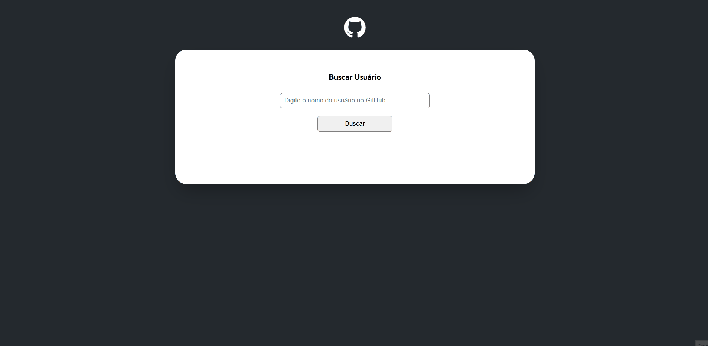

# 🚀 Projeto Inicial Fetch Github API

*Essa é uma das Quests do [Dev Em Dobro](https://www.youtube.com/c/DevemDobro).*

## 🗒️Portfólio 
* [Portfólio](https://jefferson-douglas.netlify.app/)

## 📷Screenshot Desktop

## 🛠️ Construído com

* [HTML5](https://developer.mozilla.org/pt-BR/docs/Web/HTML) - HyperText Markup Language ou Linguagem de Marcação de HiperTexto
* [CSS3](https://developer.mozilla.org/pt-BR/docs/Web/CSS) - Cascading Style Sheets ou Folhas de Estilo em Cascata
* [JavaScript](https://developer.mozilla.org/pt-BR/docs/Web/JavaScript) - Às vezes abreviado para JS

## ✒️ Autores

* **Jéfferson Douglas** - *Trabalho Inicial* - [Jéfferson]([https://github.com/linkParaPerfil](https://github.com/jersdouglas))

---